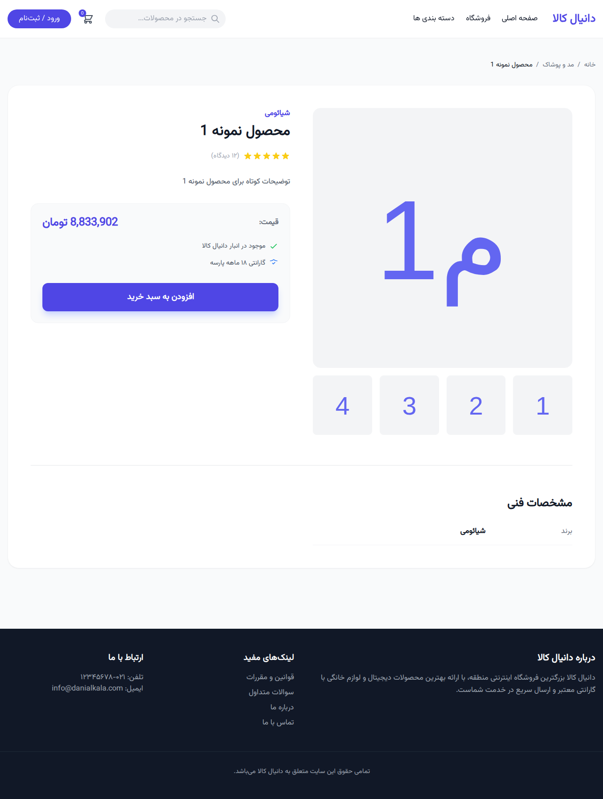

# 🛒 Danialkala - Multi-Platform E-commerce Ecosystem

**Danialkala** is a comprehensive, modern e-commerce solution built with Laravel. It features a robust API backend serving mobile applications, a highly responsive and beautiful Web Storefront, and a professional Admin Dashboard—all designed with **Tailwind CSS** and optimized for Persian users with the **Vazirmatn** font.

---

## ✨ Key Features

### 🌐 Web Storefront (Customer Side)
- **Modern UI:** Built with Tailwind CSS for a sleek, responsive experience.
- **Dynamic Homepage:** Hero sliders, category grids, and featured product sections.
- **Product Discovery:** Advanced filtering and search on the shop page.
- **Detailed Insights:** Comprehensive product pages with galleries and technical specifications.
- **Cart & Checkout:** Seamless shopping flow from cart to simulated checkout.
- **User Accounts:** Order history and profile management.

### 🛡️ Admin Dashboard
- **Analytics Widgets:** Real-time stats on sales, orders, and user growth.
- **Product Management:** Full CRUD for products, categories, brands, and colors.
- **Inventory Tracking:** Advanced status indicators for low-stock items.
- **Order Management:** Track and process customer orders effectively.
- **User Control:** Comprehensive management of registered customers.

### 📱 Backend & API
- **Existing API Core:** Fully functional RESTful APIs serving the Danialkala Android application.
- **JWT Authentication:** Secure communication between the mobile app and the server.
- **RTL Support:** Native right-to-left layout integration using Vazirmatn font.

---

## 🚀 Tech Stack

- **Framework:** [Laravel 8.x](https://laravel.com/)
- **Frontend:** [Tailwind CSS 3.x](https://tailwindcss.com/)
- **Font:** [Vazirmatn](https://github.com/rastikerdar/vazirmatn) (Persian Support)
- **Database:** SQLite (default for development), supports MySQL/PostgreSQL.
- **Asset Bundling:** [Laravel Mix (Webpack 5)](https://laravel-mix.com/)

---

## 🛠️ Installation & Setup

Follow these steps to get the project up and running locally:

### 1. Clone the repository
```bash
git clone https://github.com/your-username/danialkala.git
cd danialkala
```

### 2. Install PHP Dependencies
```bash
composer install
```

### 3. Install NPM Dependencies & Build Assets
```bash
npm install
npm run prod
```

### 4. Environment Configuration
```bash
cp .env.example .env
php artisan key:generate
```

### 5. Database Setup & Seeding
Prepare the database with realistic Persian data:
```bash
touch database/database.sqlite
php artisan migrate:fresh --seed
```

#### Default Credentials
- **Admin User:** `admin@danialkala.com` / `password`
- **Regular User:** `user@danialkala.com` / `password`

### 6. Start the Server
```bash
php artisan serve
```
Visit `http://localhost:8000` to see the storefront.

---

## 📸 UI Gallery

### Admin Dashboard

*Modern analytics and management interface.*

### Web Storefront

*Responsive customer-facing homepage.*

### Product Detail Page

*Detailed specifications and high-quality galleries.*

---

## 📄 License
The Danialkala project is open-sourced software licensed under the [MIT license](https://opensource.org/licenses/MIT).
