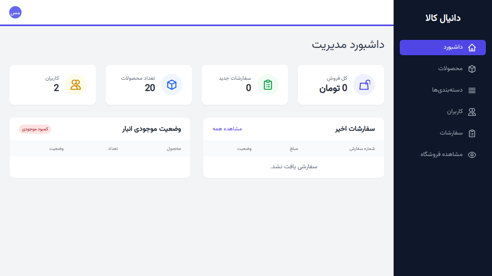
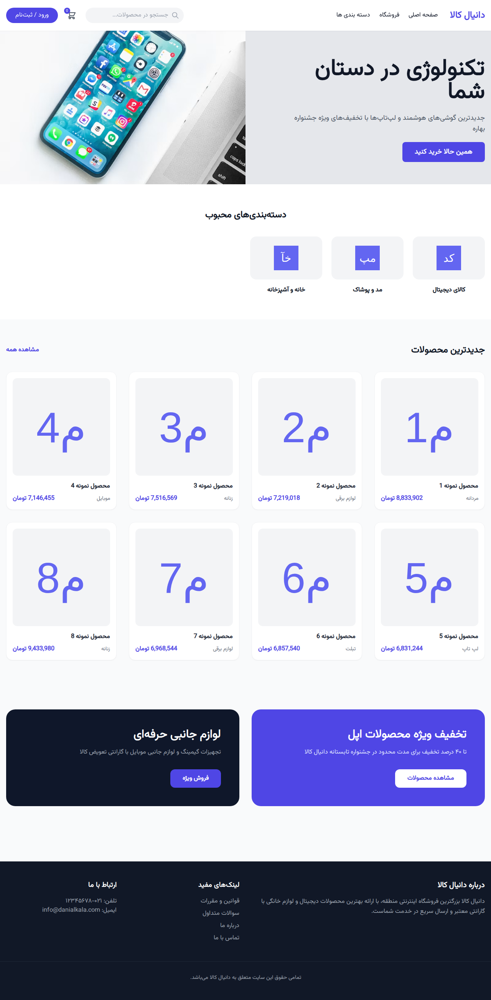

# 🛒 دانیال کالا - اکوسیستم تجارت الکترونیک چند پلتفرمی

**دانیال کالا** یک راهکار جامع و مدرن تجارت الکترونیک است که با فریم‌ورک لاراول ساخته شده است. این پروژه دارای یک بک‌اند قدرتمند API برای خدمت‌رسانی به اپلیکیشن‌های موبایل، یک فروشگاه تحت وب بسیار واکنش‌گرا و زیبا، و یک پنل مدیریت حرفه‌ای است. تمامی بخش‌ها با **Tailwind CSS** طراحی شده و با فونت **وزیرمتن** برای کاربران فارسی‌زبان بهینه شده است.

---

## ✨ ویژگی‌های کلیدی

### 🌐 فروشگاه تحت وب (سمت مشتری)
- **رابط کاربری مدرن:** ساخته شده با Tailwind CSS برای تجربه‌ای روان و واکنش‌گرا.
- **صفحه اصلی پویا:** دارای اسلایدرهای هیرو، شبکه‌بندی دسته‌بندی‌ها و بخش محصولات منتخب.
- **جستجو و فیلتر:** قابلیت‌های پیشرفته برای یافتن محصولات در صفحه فروشگاه.
- **جزئیات محصول:** صفحات کامل شامل گالری تصاویر و مشخصات فنی دقیق.
- **سبد خرید و پرداخت:** فرآیند خرید یکپارچه از سبد خرید تا شبیه‌سازی پرداخت.
- **پنل کاربری:** مدیریت تاریخچه سفارشات و اطلاعات پروفایل.

### 🛡️ پنل مدیریت
- **ویجت‌های تحلیلی:** آمار لحظه‌ای از فروش، سفارشات و رشد کاربران.
- **مدیریت محصولات:** عملیات کامل (CRUD) برای محصولات، دسته‌بندی‌ها، برندها و رنگ‌ها.
- **رهگیری انبار:** نشانگرهای پیشرفته برای وضعیت موجودی کالاها.
- **مدیریت سفارشات:** بررسی و پردازش موثر سفارشات مشتریان.

### 📱 بک‌اند و API
- **هسته API موجود:** سرویس‌های RESTful کامل برای اپلیکیشن اندروید دانیال کالا.
- **احراز هویت JWT:** ارتباط امن بین اپلیکیشن موبایل و سرور.
- **پشتیبانی RTL:** یکپارچگی کامل راست‌به‌چپ با فونت وزیرمتن.

---

## 🚀 تکنولوژی‌های مورد استفاده

- **فریم‌ورک:** [Laravel 8.x](https://laravel.com/)
- **فرانت‌اند:** [Tailwind CSS 3.x](https://tailwindcss.com/)
- **فونت:** [Vazirmatn](https://github.com/rastikerdar/vazirmatn) (پشتیبانی از فارسی)
- **پایگاه داده:** SQLite (پیش‌فرض توسعه)، پشتیبانی از MySQL/PostgreSQL.
- **بسته‌بندی دارایی‌ها:** [Laravel Mix (Webpack 5)](https://laravel-mix.com/)

---


## 📸 گالری تصاویر

### پنل مدیریت


### فروشگاه تحت وب



## 🛠️ راهنمای نصب و راه‌اندازی

### روش اول: استفاده از Docker (سریع‌ترین روش) 🐳
اگر داکر روی سیستم شما نصب است، تنها با اجرای دستورات زیر پروژه را بالا بیاورید:

```bash
docker-compose up -d
docker-compose exec app composer install
docker-compose exec app php artisan migrate:fresh --seed
```
سپس پروژه در آدرس `http://localhost:8000` در دسترس خواهد بود.

### روش دوم: نصب دستی
۱. پروژه را کلون کنید:
```bash
git clone https://github.com/your-username/danialkala.git
cd danialkala
```
۲. وابستگی‌های PHP را نصب کنید:
```bash
composer install
```
۳. وابستگی‌های NPM را نصب و دارایی‌ها را بیلد کنید:
```bash
npm install
npm run prod
```
۴. تنظیمات محیطی:
```bash
cp .env.example .env
php artisan key:generate
```
۵. راه‌اندازی پایگاه داده و داده‌های اولیه:
```bash
touch database/database.sqlite
php artisan migrate:fresh --seed
```
۶. اجرای سرور:
```bash
php artisan serve
```

#### اطلاعات ورود پیش‌فرض
- **مدیر سیستم:** `admin@danialkala.com` / `password`
- **کاربر عادی:** `user@danialkala.com` / `password`

---
---

<div dir="ltr">

# 🛒 Danialkala - Multi-Platform E-commerce Ecosystem

**Danialkala** is a comprehensive, modern e-commerce solution built with Laravel. It features a robust API backend serving mobile applications, a highly responsive and beautiful Web Storefront, and a professional Admin Dashboard—all designed with **Tailwind CSS** and optimized for Persian users with the **Vazirmatn** font.

## ✨ Key Features
- **Modern Web Storefront:** Built with Tailwind CSS, featuring dynamic homepages, advanced filters, and full checkout simulation.
- **Advanced Admin Dashboard:** Real-time analytics, inventory tracking, and full CRUD for store management.
- **Mobile API Core:** Fully functional RESTful APIs serving existing Android applications.
- **Optimized for Persian:** Full RTL support and Vazirmatn font integration.

## 🚀 Tech Stack
- **Framework:** Laravel 8.x
- **Frontend:** Tailwind CSS 3.x
- **Font:** Vazirmatn
- **Database:** SQLite / MySQL / PostgreSQL
- **Asset Bundling:** Laravel Mix (Webpack 5)

## 🛠️ Quick Start (Docker)
```bash
docker-compose up -d
docker-compose exec app composer install
docker-compose exec app php artisan migrate:fresh --seed
```
Access the project at `http://localhost:8000`.

## 📄 License
The Danialkala project is open-sourced software licensed under the [MIT license](https://opensource.org/licenses/MIT).

</div>
